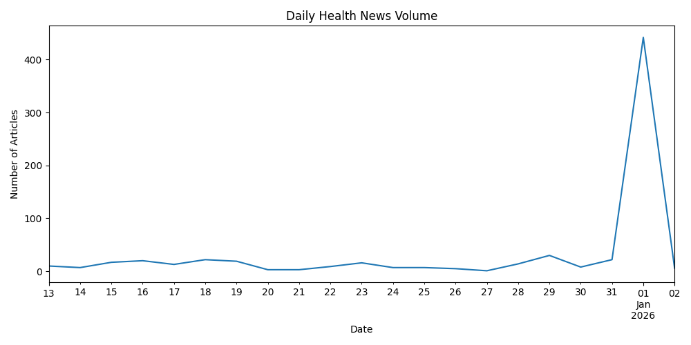
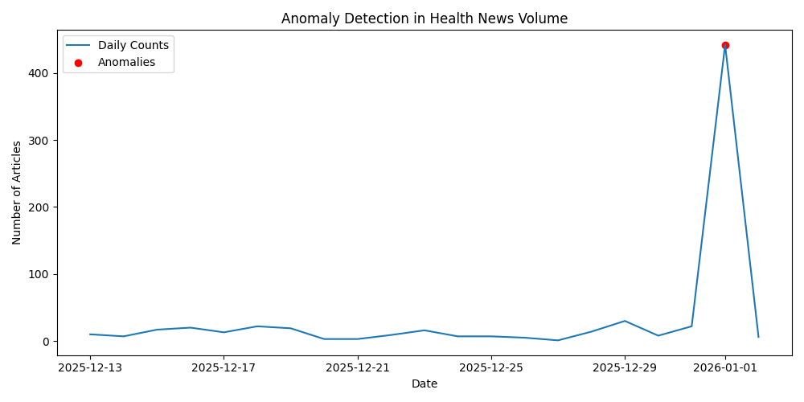
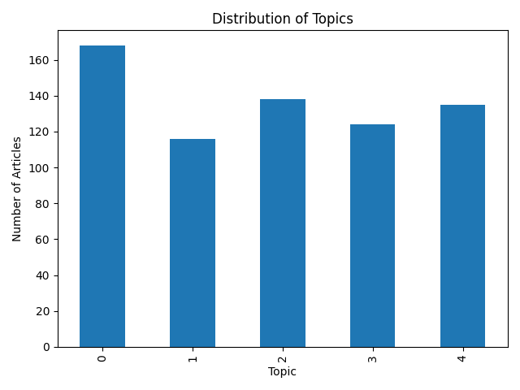
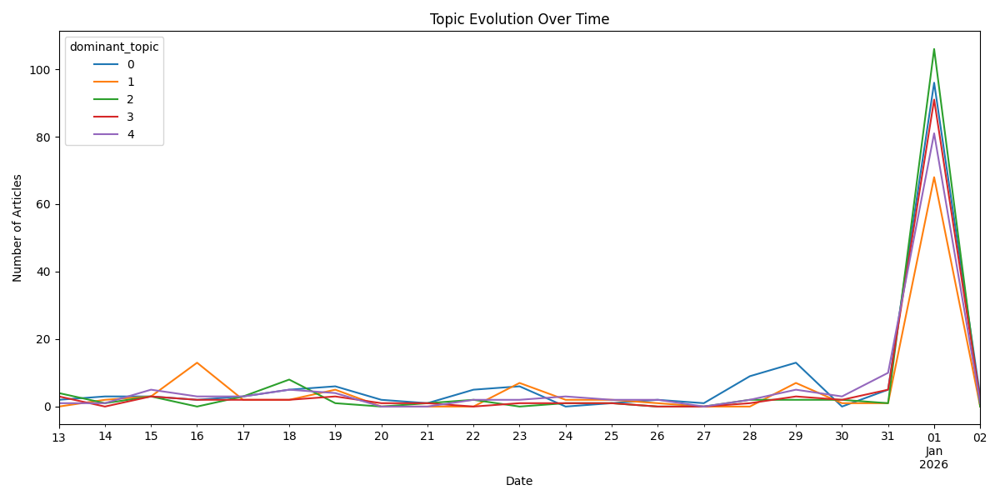

# Early Detection of Health Signals in Global News Streams Using Topic Modeling and Time-Series Anomaly Detection

This project analyzes a sample of global news data from the **GDELT project** to identify health-related trends, detect unusual spikes in reporting activity, and extract latent thematic structures using topic modeling.

It explores how global news streams can be used as a retrospective proxy for public health-related signals, combining NLP and time-series analysis to detect emerging patterns in news coverage.

The project also considers the limitations and ethical implications of using news data for public health signal detection.

A full LaTeX-based research report is included in the `report/` directory, providing a detailed description of the methodology, experimental design, results, and discussion.


## Project Objectives

- Collect and process global news data (GDELT)
- Extract and analyze health-related keywords and trends over time
- Apply **topic modeling (LDA)** to discover latent themes
- Detect abnormal spikes in news activity using statistical methods
- Compare topic distributions between normal and anomaly periods
- Visualize temporal dynamics of health-related news coverage


## Key Features

- End-to-end NLP pipeline on real-world global news data
- Integration of:
  - Time-series analysis
  - Topic modeling (LDA)
  - Statistical anomaly detection
- Fully reproducible pipeline with modular scripts and notebooks
- Interpretable outputs for exploratory and research analysis


## Methods & Techniques

### Data Processing
- GDELT news dataset ingestion via API
- Cleaning, filtering, and time normalization
- Keyword extraction and aggregation

### NLP & Topic Modeling
- TF-IDF vectorization for feature extraction
- Latent Dirichlet Allocation (LDA) for unsupervised topic discovery
- Topic interpretation via top-word inspection and manual labeling

### Time-Series Analysis
- Daily article volume aggregation
- Keyword trend tracking over time
- Topic evolution analysis

### Anomaly Detection
- Z-score based statistical anomaly detection
- Identification of outlier days in news volume
- Comparison of anomaly vs normal topic distributions


## Results and Discussion

### Key Findings

- The dataset contains 681 articles collected over a ~3-week period
- News volume shows **sharp event-driven spikes**, particularly around specific dates
- A major anomaly is detected on **January 1st, 2026**, accounting for ~65% of total articles

#### Topic modeling Findings
- A clear **antibiotic resistance / AMR health cluster** is identified
- Multiple **mixed geopolitical + health-related topics** emerge
- Several noisy multilingual and global event-driven clusters are present due to keyword ambiguity

#### Temporal and anomaly Interpretation
- Anomalies are not always health-specific, highlighting the challenge of semantic filtering in global news streams
- Topic activity spikes are **system-wide rather than topic-specific**, indicating broad increases in news reporting rather than isolated thematic events

### Visualizations

#### News Volume Over Time
Daily global health-related article counts over time.



---

#### Anomaly Detection
Detected spike in news activity using statistical z-score method.



---

#### Topic Distribution
Distribution of LDA-derived topics across the dataset.



---

#### Topic Evolution Over Time
Temporal dynamics of topic prevalence and spikes.




## Project Structure

```bash
health-trend-anomaly-detection/
│
├── data/
│   ├── raw/                  # Raw GDELT data
│   ├── processed/           # Cleaned datasets + topic/anomaly outputs
│   └── features/            # Engineered time series features
│
├── models/                  # Saved LDA model + vectorizer
│
├── outputs/
│   └── plots/               # All visualizations
│
├── src/
│   ├── data_processing.py
│   ├── topic_modeling.py
│   ├── feature_engineering.py
│   ├── anomaly_detection.py
│
├── notebooks/
│   └── analysis.ipynb       # Final analysis & interpretation
│
├── report/
│   └── early_detection_health_signals_news_report.pdf   # LaTeX research report
│
├── requirements.txt
└── README.md
```


### Reproducibility

The full pipeline can be reproduced by running the scripts in `src/` in order:

```bash
python src/data_collection.py
python src/preprocessing.py
python src/topic_modeling.py
python src/feature_engineering.py
python src/anomaly_detection.py
```

All outputs (plots, models, and processed data) are generated automatically from these steps.


## How to Run the Project

### 1. Install dependencies

```bash
pip install -r requirements.txt
```

### 2. Run pipeline scripts in order

```bash
python src/data_processing.py
python src/topic_modeling.py
python src/feature_engineering.py
python src/anomaly_detection.py
```

### 3. Run analysis notebook

Open the Jupyter notebook:

`notebooks/analysis.ipynb`

This notebook:
- Loads processed datasets
- Visualizes trends, topics, and anomalies
- Performs final interpretation


## Models

The `models/` directory contains serialized models:

- `lda_model.pkl`: trained LDA topic model
- `vectorizer.pkl`: TF-IDF vectorizer

These are saved using joblib for reproducibility.


## Limitations

- Keyword-based filtering introduces noise (non-health content in queries like “virus”)
- LDA topics are sensitive to preprocessing choices and require manual interpretation
- Short time window limits long-term trend analysis
- Anomaly detection is purely statistical (no causal inference)


## Future Improvements

- Replace LDA with BERTopic or embedding-based models
- Add geographic filtering (country-level health signal detection)
- Use time-series forecasting (Prophet / ARIMA)
- Improve semantic filtering of health-related content
- Build interactive dashboard (Streamlit / Plotly Dash)


## Ethical Considerations

This project uses publicly available global news data from the GDELT project. While this enables analysis of real-world news streams, several limitations and ethical considerations should be acknowledged:

- **Data Noise & Ambiguity**  
  Keyword-based filtering (e.g., "virus") may include non-health-related content, introducing noise and potential misinterpretation.

- **Bias in News Coverage**  
  GDELT reflects global media reporting, which may be uneven across regions, languages, and political contexts. As a result, detected trends may reflect media bias rather than real-world health dynamics.

- **Topic Model Interpretability**  
  LDA produces probabilistic topic clusters that require manual interpretation. Mislabeling or overinterpretation of topics may lead to incorrect conclusions.

- **Anomaly Detection Limitations**  
  Detected anomalies represent statistical deviations in article volume, not verified real-world events. These signals should not be interpreted as causal or predictive without further validation.

- **Responsible Use**  
  This system is intended for exploratory analysis and research purposes only. It should not be used for real-time public health decision-making without additional validation and domain expertise.

This project highlights the importance of combining computational methods with critical interpretation when working with real-world noisy text data.


## Data Source

- GDELT Project – Global Database of Events, Language, and Tone  
  https://www.gdeltproject.org/


## Dataset

This repository includes a keyword-filtered dataset of 681 articles global news articles (~179 KB of text data) collected via the GDELT API for reproducibility and experimentation. 

- Raw data: `data/raw/`
- Processed data: `data/processed/`
- Feature data: `data/features/`

## Author

**Giorgia Sorrentino**
MSc Computational Linguistics 
